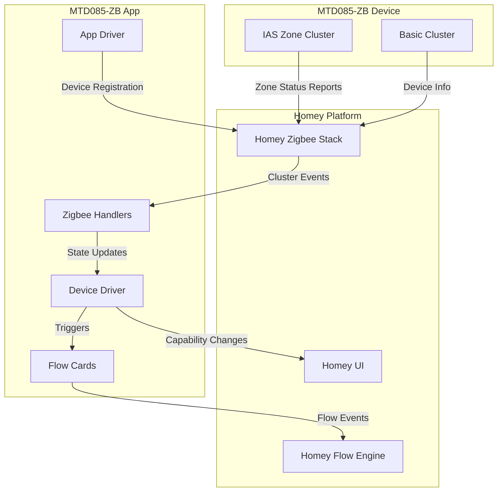

# Design Document: Homey MTD085-ZB App

## Overview

This document describes the design for a Homey app supporting the Wenzhi/LeapMMW MTD085-ZB mmWave presence sensor. The app enables Homey users to integrate this Tuya-based Zigbee sensor (TS0225) into their smart home automation workflows.

The sensor uses the standard Zigbee IAS Zone cluster for presence reporting, making it compatible with Homey's built-in Zigbee stack. The app will handle device pairing, IAS Zone configuration, presence state management, and flow card integration.

## Architecture



### Component Responsibilities

- **App Driver**: Registers the app with Homey, defines supported devices
- **Device Driver**: Manages individual device instances, handles lifecycle events
- **Zigbee Handlers**: Processes IAS Zone cluster reports, configures device
- **Flow Cards**: Defines triggers and conditions for Homey flows

## Components and Interfaces

### 1. App Manifest (app.json)

The app manifest defines metadata, capabilities, and device definitions.

```typescript
interface AppManifest {
  id: string;                    // "com.wenzhi.mtd085zb"
  version: string;               // Semantic version
  compatibility: string;         // Homey version compatibility
  sdk: number;                   // SDK version (3)
  brandColor: string;            // Brand color hex
  name: Record<string, string>;  // Localized names
  description: Record<string, string>;
  category: string[];            // ["security"]
  permissions: string[];         // []
  images: ImagePaths;
  drivers: DriverDefinition[];
  flow: FlowDefinition;
}
```

### 2. Device Driver Interface

```typescript
interface MTD085ZBDriver {
  // Lifecycle methods
  onInit(): Promise<void>;
  onAdded(): Promise<void>;
  onDeleted(): Promise<void>;
  
  // IAS Zone handling
  onIASZoneStatusChange(zoneStatus: ZoneStatusPayload): Promise<void>;
  configureIASZone(): Promise<void>;
  
  // State management
  setMotionAlarm(detected: boolean): Promise<void>;
  getMotionAlarm(): boolean;
}
```

### 3. Zone Status Parser

```typescript
interface ZoneStatusPayload {
  zoneStatus: number;  // 16-bit bitmap
}

interface ParsedZoneStatus {
  alarm1: boolean;     // Bit 0: Zone alarm 1 (presence detected)
  alarm2: boolean;     // Bit 1: Zone alarm 2
  tamper: boolean;     // Bit 2: Tamper
  battery: boolean;    // Bit 3: Battery low
  supervisionReports: boolean;  // Bit 4
  restoreReports: boolean;      // Bit 5
  trouble: boolean;    // Bit 6
  acMains: boolean;    // Bit 7
}

function parseZoneStatus(zoneStatus: number): ParsedZoneStatus;
function isPresenceDetected(zoneStatus: number): boolean;
```

### 4. Device Matcher

```typescript
interface ZigbeeDeviceInfo {
  modelId: string;
  manufacturerName: string;
}

function isMatchingDevice(device: ZigbeeDeviceInfo): boolean;
```

## Data Models

### Device Configuration

```typescript
interface DeviceSettings {
  zclVersion: number;
  appVersion: number;
  manufacturerName: string;
  modelId: string;
  powerSource: string;
}

interface DeviceStore {
  iasZoneEnrolled: boolean;
  cieAddressConfigured: boolean;
}
```

### Capability State

```typescript
interface DeviceCapabilities {
  alarm_motion: boolean;  // Current presence state
}
```

### Flow Card Definitions

```typescript
interface FlowTrigger {
  id: string;           // "motion_detected" | "motion_cleared"
  title: Record<string, string>;
}

interface FlowCondition {
  id: string;           // "is_motion_detected"
  title: Record<string, string>;
}
```

## Correctness Properties

*A property is a characteristic or behavior that should hold true across all valid executions of a system-essentially, a formal statement about what the system should do. Properties serve as the bridge between human-readable specifications and machine-verifiable correctness guarantees.*

### Property 1: Device Identification Matching

*For any* Zigbee device info containing modelId and manufacturerName, the device matcher SHALL return true if and only if modelId equals "TS0225" AND manufacturerName equals "_TZ321C_fkzihax8".

**Validates: Requirements 1.1**

### Property 2: Zone Status to Motion Capability Mapping

*For any* IAS Zone status value (16-bit integer), the motion alarm capability SHALL be set to true if and only if bit 0 (alarm1) of the zone status is set to 1.

**Validates: Requirements 2.1, 2.2**

### Property 3: Flow Card Triggering on State Change

*For any* presence state transition, when the motion alarm capability changes from false to true, the "motion_detected" trigger SHALL fire; when it changes from true to false, the "motion_cleared" trigger SHALL fire; when the state does not change, no trigger SHALL fire.

**Validates: Requirements 3.1, 3.2**

### Property 4: Configuration Retry Logic

*For any* sequence of IAS Zone configuration attempts where the first N attempts fail (N < 3), the system SHALL retry until success or until 3 failures occur, at which point it SHALL report failure.

**Validates: Requirements 4.4**

### Property 5: App Manifest Validation

*For any* valid app manifest, the manifest SHALL contain all required fields: id, version, compatibility, sdk, name, description, category, drivers, and the sdk field SHALL be >= 3.

**Validates: Requirements 6.1, 6.5**

### Property 6: Localization Completeness

*For any* localization file, all required keys (app name, app description, device name, flow card titles) SHALL be present and non-empty for the English locale.

**Validates: Requirements 6.3**

## Error Handling

### Pairing Errors

| Error Condition | Handling Strategy |
|----------------|-------------------|
| Device not found | Display "Device not discovered" message |
| Network join failure | Display "Failed to join network" with retry option |
| IAS Zone config failure | Retry up to 3 times, then display configuration error |
| Timeout during pairing | Display timeout message with retry option |

### Runtime Errors

| Error Condition | Handling Strategy |
|----------------|-------------------|
| Zone status parse error | Log error, maintain previous state |
| Device offline | Set unavailable flag, clear on reconnect |
| Cluster read failure | Retry with exponential backoff |

### Error Message Format

```typescript
interface HomeyError {
  message: string;      // User-friendly message
  code: string;         // Error code for debugging
  cause?: Error;        // Original error if wrapped
}
```

## Testing Strategy

### Property-Based Testing

The app will use **fast-check** as the property-based testing library for JavaScript/TypeScript.

Each property-based test MUST:
- Run a minimum of 100 iterations
- Be tagged with a comment referencing the correctness property: `**Feature: homey-mtd085-zb-app, Property {number}: {property_text}**`
- Generate inputs that cover the full valid input space

Property tests to implement:
1. Device matcher with random modelId/manufacturerName combinations
2. Zone status parser with all possible 16-bit values
3. State change trigger logic with random state sequences
4. Retry logic with random failure sequences
5. Manifest validation with various field combinations
6. Localization validation with random key sets

### Unit Testing

Unit tests will cover:
- Specific edge cases for zone status parsing (0x0000, 0x0001, 0xFFFF)
- IAS Zone configuration command sequences
- Device lifecycle methods (onInit, onAdded, onDeleted)
- Flow card registration

### Integration Testing

Manual integration tests:
- Device pairing with actual MTD085-ZB hardware
- Presence detection response time
- Reconnection after power cycle
- Flow automation execution

### Test File Structure

```
test/
├── unit/
│   ├── zone-status-parser.test.ts
│   ├── device-matcher.test.ts
│   └── flow-cards.test.ts
├── property/
│   ├── zone-status.property.test.ts
│   ├── device-matcher.property.test.ts
│   ├── state-transitions.property.test.ts
│   ├── retry-logic.property.test.ts
│   ├── manifest.property.test.ts
│   └── localization.property.test.ts
└── fixtures/
    └── sample-device-data.ts
```
