# Design Document: IAS Zone Enrollment Fix

## Overview

This document describes the design for fixing the IAS Zone enrollment issue in the Homey MTD085-ZB app. The current implementation uses an incorrect attribute name (`iasCieAddress`) when attempting to write the CIE address to the IAS Zone cluster, causing enrollment to fail. The fix involves updating the attribute name to the correct Zigbee specification value (`cieAddr`) and ensuring robust error handling.

## Architecture

The fix involves modifying the existing `configureIASZone()` method in the MTD085ZBDevice class to use the correct Zigbee attribute name while maintaining all existing functionality and error handling.

```mermaid
graph TB
    subgraph "Current (Broken) Flow"
        A1[Device Pairing] --> B1[configureIASZone]
        B1 --> C1[writeAttributes iasCieAddress]
        C1 --> D1[Error: Invalid Attribute]
        D1 --> E1[Retry 3 times]
        E1 --> F1[Enrollment Failed]
    end
    
    subgraph "Fixed Flow"
        A2[Device Pairing] --> B2[configureIASZone]
        B2 --> C2[writeAttributes cieAddr]
        C2 --> D2[Success]
        D2 --> E2[Device Sends Enroll Request]
        E2 --> F2[Enrollment Complete]
    end
```



## Components and Interfaces

### 1. Modified configureIASZone Method

The primary change is in the attribute name used when writing the CIE address:

```javascript
// Current (broken) implementation
await iasZoneCluster.writeAttributes({
  iasCieAddress: this.homey.zigbee.ieeeAddress,
});

// Fixed implementation
await iasZoneCluster.writeAttributes({
  cieAddr: this.homey.zigbee.ieeeAddress,
});
```

### 2. Zigbee IAS Zone Cluster Attributes

According to the Zigbee Cluster Library specification, the IAS Zone cluster attributes are:

| Attribute ID | Name | Type | Description |
|-------------|------|------|-------------|
| 0x0000 | zoneState | enum8 | Current zone state |
| 0x0001 | zoneType | enum16 | Type of zone |
| 0x0002 | zoneStatus | bitmap16 | Zone status bitmap |
| 0x0010 | cieAddr | EUI64 | IEEE address of CIE device |

The correct attribute name for the CIE address is `cieAddr` (0x0010), not `iasCieAddress`.

### 3. Error Handling Strategy

The fix maintains the existing retry logic but improves error reporting:

```javascript
async configureIASZone() {
  const iasZoneCluster = this.zclNode.endpoints[1].clusters.iasZone;

  if (!iasZoneCluster) {
    throw new Error('IAS Zone cluster not available');
  }

  // Check current zone state
  const { zoneState } = await iasZoneCluster.readAttributes(['zoneState']);
  this.log('Current zone state:', zoneState);

  if (zoneState === 'enrolled') {
    this.log('Device already enrolled');
    await this.setStoreValue('iasZoneEnrolled', true);
    return;
  }

  // Write CIE address using correct attribute name
  this.log('Writing CIE address to trigger enrollment...');
  try {
    await iasZoneCluster.writeAttributes({
      cieAddr: this.homey.zigbee.ieeeAddress, // Fixed attribute name
    });
    this.log('CIE address written successfully');
  } catch (error) {
    this.error('Failed to write CIE address:', error.message);
    throw error; // Re-throw to trigger retry logic
  }

  // Rest of the method remains the same...
}
```

## Data Models

### Device Store Updates

The device store structure remains unchanged, but we'll add a new flag to track the fix application:

```javascript
interface DeviceStore {
  iasZoneEnrolled: boolean;        // Existing
  cieAddressConfigured: boolean;   // Existing
  enrollmentFixApplied: boolean;   // New - tracks if fix has been applied
}
```

### Migration Strategy

For existing devices that failed enrollment, we'll check the enrollment status on initialization and retry if needed:

```javascript
async onNodeInit({ zclNode }) {
  // ... existing initialization code ...

  // Check if device needs enrollment retry after fix
  const isEnrolled = this.getStoreValue('iasZoneEnrolled');
  const fixApplied = this.getStoreValue('enrollmentFixApplied');
  
  if (!isEnrolled || !fixApplied) {
    this.log('Attempting IAS Zone enrollment with fix...');
    try {
      await this.configureIASZoneWithRetry();
      await this.setStoreValue('enrollmentFixApplied', true);
    } catch (error) {
      this.error('Failed to configure IAS Zone:', error.message);
    }
  }
}
```

## Error Handling

### Attribute Write Errors

| Error Type | Handling Strategy |
|-----------|-------------------|
| Invalid attribute name | Fixed by using correct `cieAddr` attribute |
| Device not responding | Retry with exponential backoff (existing) |
| Cluster not available | Log error and fail gracefully (existing) |
| Network timeout | Retry with existing retry logic |

### Backward Compatibility

The fix ensures backward compatibility by:

1. Checking enrollment status before attempting configuration
2. Not breaking existing enrolled devices
3. Gracefully handling devices that are already working
4. Maintaining all existing error handling and retry logic

## Testing Strategy

### Unit Tests

1. **Attribute Name Validation**: Test that the correct attribute name is used
2. **Error Handling**: Test that attribute write errors are properly handled
3. **Retry Logic**: Verify that existing retry logic still works
4. **Migration Logic**: Test that existing devices are handled correctly

### Integration Tests

1. **Device Enrollment**: Test with actual MTD085-ZB hardware
2. **Existing Device Migration**: Test with devices that previously failed enrollment
3. **Error Recovery**: Test behavior when enrollment fails and succeeds on retry

### Test Cases

```javascript
// Test correct attribute name usage
test('should use cieAddr attribute for CIE address', async () => {
  const mockCluster = {
    writeAttributes: jest.fn().mockResolvedValue({}),
    readAttributes: jest.fn().mockResolvedValue({ zoneState: 'notEnrolled' })
  };
  
  await device.configureIASZone();
  
  expect(mockCluster.writeAttributes).toHaveBeenCalledWith({
    cieAddr: expect.any(String)
  });
});

// Test migration for existing devices
test('should retry enrollment for previously failed devices', async () => {
  device.setStoreValue('iasZoneEnrolled', false);
  device.setStoreValue('enrollmentFixApplied', false);
  
  await device.onNodeInit({ zclNode: mockZclNode });
  
  expect(device.configureIASZoneWithRetry).toHaveBeenCalled();
});
```

## Implementation Steps

1. **Update configureIASZone method**: Change `iasCieAddress` to `cieAddr`
2. **Add migration logic**: Check and retry enrollment for existing devices
3. **Update error logging**: Improve error messages for debugging
4. **Add tests**: Create unit tests for the fix
5. **Test with hardware**: Verify fix works with actual device
6. **Deploy and monitor**: Deploy fix and monitor enrollment success rates

## Risk Assessment

### Low Risk
- The change is minimal and well-defined
- Existing retry logic provides safety net
- Backward compatibility is maintained

### Mitigation Strategies
- Thorough testing with actual hardware before deployment
- Gradual rollout to monitor for any unexpected issues
- Ability to rollback if problems are discovered
- Enhanced logging to track enrollment success rates